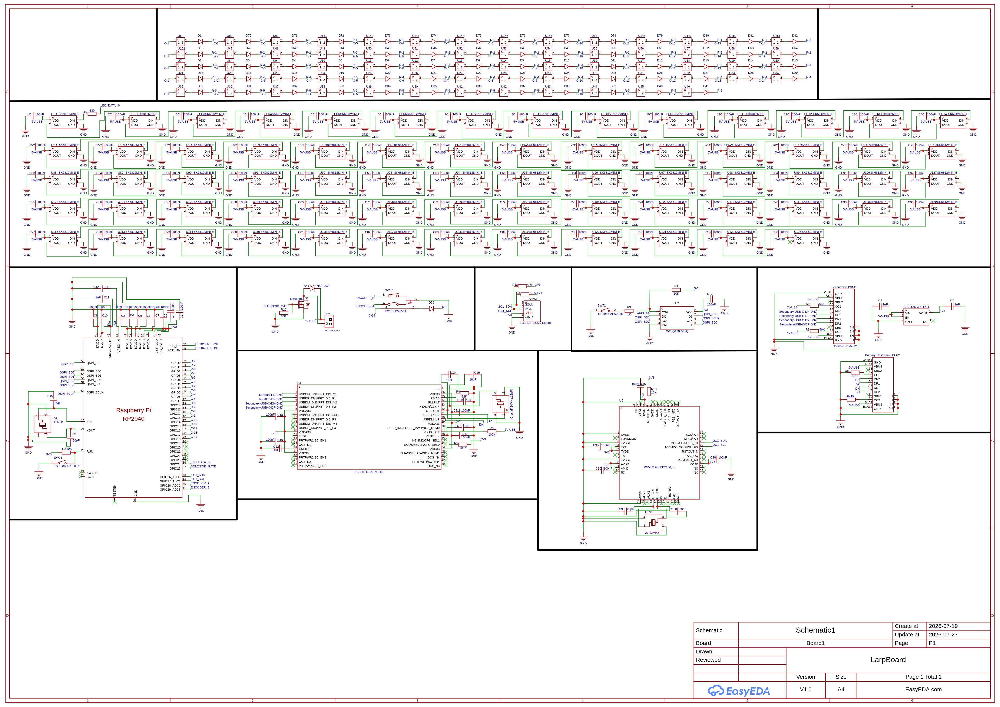
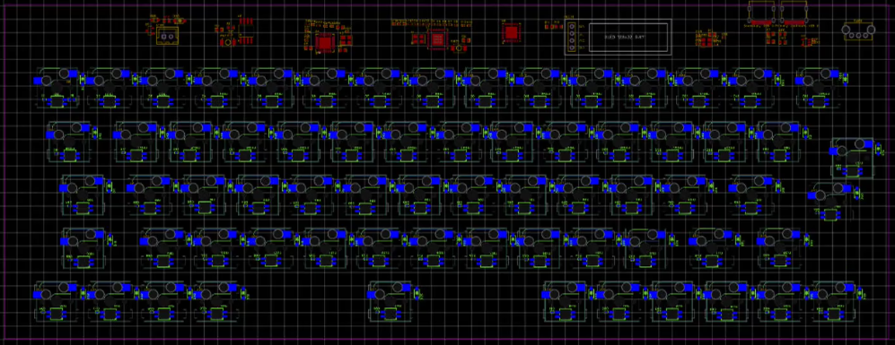
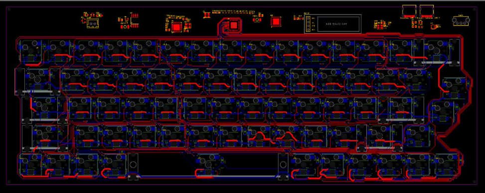
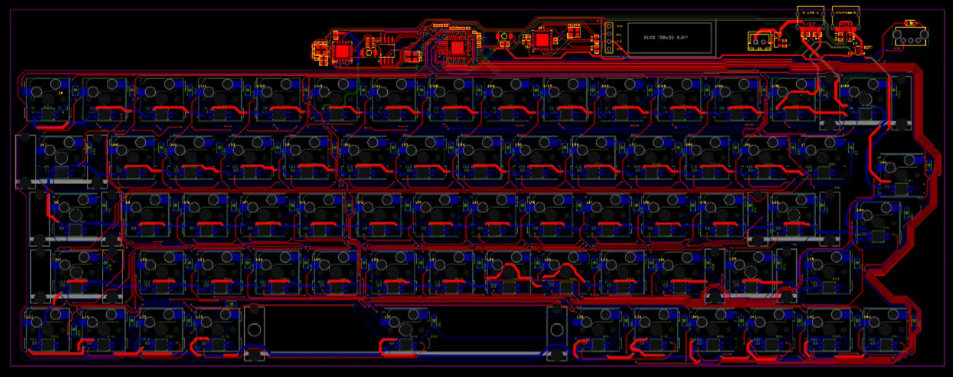
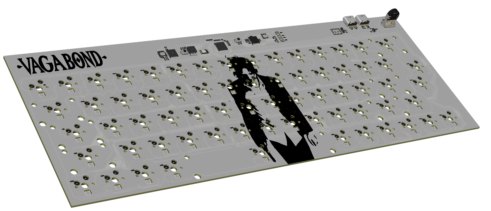

# LarpBoard: A Keyboard for Larpers.

## What is Larp?

Larp Means to Speak About or Show Affection to Something You don't know Anything About. Just following the Trend. Not having a single Clue about the Genre. Common Larpers are people who Have Not Played a Single Devil May Cry Games but Seem to "Like" it, and someone who hasn't watched a single episode of "Serial Experiment Lain" but uses the Main Character as a pfp (Myself Included).

 and on the rise right now are the **Linux Larpers**, who run Cmatrix in the terminal and think that they are some kind of hackers or something (Me asf).

Well Larping is a Skill in itself, and there are levels to ts. So thats why I'm making this LarpBoard, to Enhance the Experience of Larpers and Helping them achieve True Larping-ness.

## LarpBoard

LarpBoard is a 65% Keyboard Designed for Professional Larpers. Keep in mind tho that you will not get ANY girls if you have this (More MEN attraction). Build and Use this at your own Risk. Well Lets Talk about why this Keyboard will be unique and better than other Low Level Keyboards. This Keyboard Includes Kailh Hot-Swap Sockets and RGB LEDs. A 0.9inch OLED Display for CMatrix. A rollable Volume Knob cuz why not, an NFC reader cuz why not, a solenoid for sound, 2 USB-C Ports, a USB Hub Chip and the Main MCU RP2040.

Well these are the Names and Details of the Components in Detail.

- **MCU: RP2040:**

This is the Main Chip which Makes everything Work Together, This Chip Requires 3.3V so we need another thing to make it work, which is.... you guessed it

- **LDO: AP2112K-3.3TRG1:**

This is the Stuff that eats 5V from the USB-C and converts it into 3V for everything on my LarpBoard PCB, like literally everything. There are other pretty popular LDO's like AMS1117 etc. We also need A Flash Memory for RP2040.

- **FLASH: W25Q128JVSIQ:**

This is a 16MB (128M-bit) SPI Flash memory chip, because RP2040 Doesn't have it's own internal Storage, i have to use this.

- **MCU Clock: 12MHz Crystal Oscillator**

This Provides the Pulse for when the RP2040 needs to work etc, i also added 2 20pF Capacitors, because that's something you need to do apparantly

- **Buttons: TS-1088-AR02016:**

Need these buttons to reset and boot the RP2040. Thats all, i mean what did you expect a button to do.

- **USB Ports: TYPE-C-31-M-12:**

I'm Using two of these, one for Upstream and one for obviously Downstream. It's always fun to add USB-C, maybe i'll add 10 next who knows, wait i got another idea. peak, see you with another project after arcana.

- **Switches: Kailh Choc hotswap sockets:**

Added 68 of these, i heard that these are pretty good and low profile.

- **Diodes: 1N4148**

Used this because this helps prevent Ghosting when you press multiple keys at once, which is peak. used 68 of these too.

- **Addressable LED's: SK6812MINI-E:**

These are RGB Addressable LED's which are placed directly under the keycaps, so it shines the light from beneath. Used 68 of these too, also added the required resistors and capacitors. I had to add 68 100nF Decoupling Capacitors to prevent color flikering and power drops.

- **USB-HUB: USB2514B-AEZC-TR:**

A dedicated 2.0 Hub chip, it splits the board's main USB connection internally to route data to the secondary USB-C port. and also other internal peripherals

- **NFC/RFID Controller: PN5321A3HN/C106,55:**

So you can swipe your cards or anything that can be read by NFC right on your keyboard. I had to use a 27.12MHz Crystal Oscillator.

- **OLED Display: OLED-0.91-128x32-I2C-THT:**

A 0.91 Inch OLED screen running on I2C to help you larp better by showing Cmatrix or typing speed (if thats your thing).

- **Rotary Encoder: EC10E1220501:**

A sideways, rollable Volume knob. Cuz why not.

### These are all the Components.

## 19-July-2026 

### Schematics:

Started Working on the Schematics and placed all the components and their respective capacitors and resistors. I also had alot of problems as always, the first problem was finding the right footprints and symbols for the Sockets and LED's. I had to use the User-Contributed Footprints. 

**Kailh Hot-Swap Sockets Problem:**

Even after that, i realized later that the guy who made the footprint, made the pads and everything stay on the bottom layer, so EasyEDA shows that its on the top layer, even tho it isn't. and that wasted alot of my time to figure out what was wrong. i just had to edit the footprint to make the pads and everything stay on the top layer and fixed the 3D model etc too.

Wiring everything was a pain because i had so many different things to lookout for, had to wire everything of the RP2040 to every other component. The Process was simple tho because I just had to think of how everything powers. 5V comes from the Computer etc through the USB-C Port and first gets into the LDO, which converts that 5V into a smooth and stable 3.3V for all the other components, I then just wire everything from the LDO to everything else. simple logic. But since I had SOOOOOO many components, this took ALOT of time, well after wiring everything, here's how it looks.

[Lapse-Recording](https://lapse.hackclub.com/timelapse/jaFWriPHnn3V)

## 26-July-2026 - 29-July-2026

### PCB Design:

Took a HUGE break in between cuz i had to buy the passport and do all that shi, it is such a pain to go to the government offices etc but Alhamdulillah, i got everything successfully tho. I also had other stuff to do and i was tired thats why i didn't write much in the journal. I started working on the PCB design and it SOOO laggy, i had to download the easyEDA software. and thankfully it was on linux but man it still gives errors and stuff sometimes. but it was working smoothly. I started by placing the components and its capacitors and resistors as close as possible to each other. after that i started routing everything. but there was a problem, all the leds and sockets showed DRC errors, because the PADs and stuff were too close to each but thats how the footprints are for sockets and LEDs so i had to change the Design rule to make it not show errors. Here is how everything was placed:

- **Placement of the Sockets:**
Well obviously the Sockets were placed 1 Unit away from each other which is the size of a normal Keycaps. well my sockets footprint had a box around it, which shows how much area each key takes, so it was pretty easy to place and design the keyboard, my keyboard includes 68 keys, which is all the letters and the arrow keys, i also added two different keys which i will use for copy and pasting. this will be such a peak keyboard man. After placing all the Sockets, this is how it looked:

Now i just had to wire all of them together which took ALOTT of time, i worked like 10+ hours a day for this. and if i still can't go to arcana then i would cry man. well i started wiring the sockets to the diodes first and then sockets to sockets. after that was done, i wired the LED's together in a daisy chain type stuff. i also had to add stabalizers on the keys which took 2 units or more. i found the footprint for the stablizer and placed it according to the center hole of the key. Here's how it looks now:

I'm pretty happy with the wiring as of now and really like how it is looking. Now i have to wire all the other components and then make a ground plane to finish the PCB. Here's how it looks after wiring everything, this took another 10 hours btw:

idk about you but this looks so good to me man. Im finally done with everything on the PCB and i can finally ship this now. I also need to write the readme tho.

[Lapse-Recording-1](https://lapse.hackclub.com/timelapse/z0EAE3T4yNss)
[Lapse-Recording-2](https://lapse.hackclub.com/timelapse/z0EAE3T4yNss)
[Lapse-Recording-3](https://lapse.hackclub.com/timelapse/z0EAE3T4yNss)

## 26-August-2026 - 27-August-2026

### Designing the PCB:

Ofc I couldn't have just left it like that, i had to make it look good. Well I did just that and Added some Silkscreen Art to the PCB. Here's how it Looks.

Used the Monster Anime for Inspiration this time, ah man it is soooo peak. I can finally submit it now.

[Lapse-Recording](https://lapse.hackclub.com/timelapse/z0EAE3T4yNss)
[Lapse-Recording](https://lapse.hackclub.com/timelapse/z0EAE3T4yNss)

***//See you Space Cowboy***