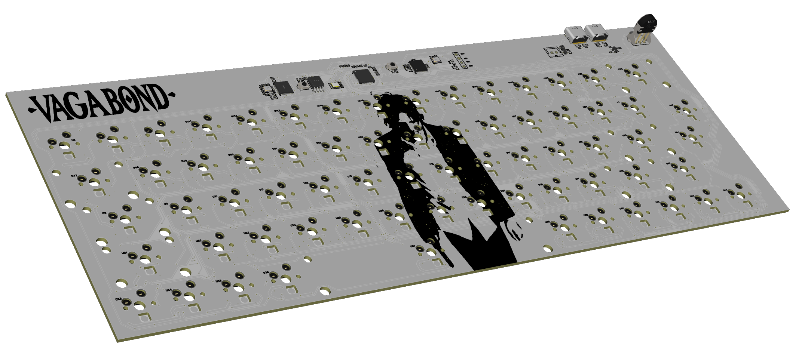
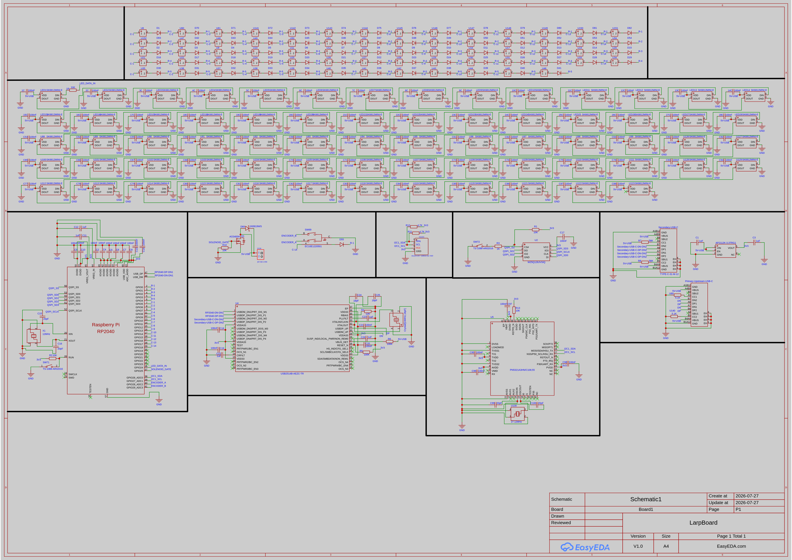
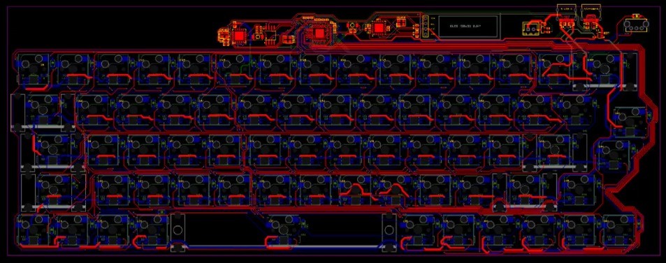
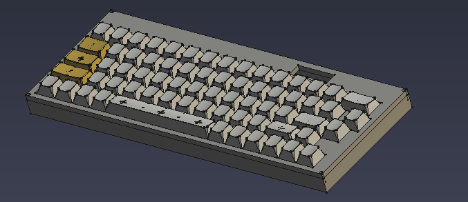

[![Contributors][contributors-shield]][contributors-url]
[![Forks][forks-shield]][forks-url]
[![Stargazers][stars-shield]][stars-url]
[![Issues][issues-shield]][issues-url]
[![Unlicense License][license-shield]][license-url]

 

  
  <h3 align="center">LarpBoard</h3>

  

    A Keyboard for Larpers
     
     
    <a href="https://github.com/TrulyVagabond/LarpBoard/blob/main/JOURNAL.md">Journal</a>
    &middot;
    <a href="https://github.com/TrulyVagabond/LarpBoard/issues">Report Bug</a>
    &middot;
    <a href="https://github.com/TrulyVagabond/LarpBoard/issues">Request Feature</a>
  

## What is LarpBoard?

LarpBoard is a 65% Keyboard Designed for Professional Larpers. Keep in mind tho that you will not get ANY girls if you have this (More MEN attraction). Build and Use this at your own Risk. Well Lets Talk about why this Keyboard will be unique and better than other Low Level Keyboards. This Keyboard Includes Kailh Hot-Swap Sockets and RGB LEDs. A 0.9inch OLED Display for CMatrix. An NFC reader cuz why not, a solenoid for sound, 2 USB-C Ports, a USB Hub Chip and the Main MCU RP2040.

### Schematics:

### PCB Wiring: 

### Case Render:

### Built With

* [![EasyEDA][EasyEDA]][EasyEDA-url]
* [![FreeCAD][FreeCAD]][FreeCAD-url]

## Getting Started

To get Your own LarpBoard, you need three things.

- PCB
- 3d-Printed Enclosure
- Money

### Ordering the PCB

1. Navigate to the Gerber Files in the **"Gerber"** Folder. 

2. Download the ".zip" File

3. Upload this '.zip' file to a custom PCB manufacturer (Like PCBWay, OSH Park or JLCPCB) or not if you're going to solder on your own

4. Standard Manufacturing Settings (1.6mm thickness) work Perfectly for this Board.

### 3D Printing the Enclosure

1. Navigate to the **"CAD"** folder.

2. Download the .Step File and Upload it into your Desired 3D slicing Software.

## Bills Of Materials (BOM)

| Qty | Component | Designator | Direct Source Link | Unit Cost | Total |
| :--- | :--- | :--- | :--- | :--- | :--- |
| 87 | 100nF Capacitor | 1C, 2C, 3C, 4C... | [LCSC Catalog](https://www.lcsc.com/product-detail/C307380.html?s_z=n_q_0201%2520100nF) | $0.0061 | $0.53 |
| 1 | 330Ω Resistor | 1R | [LCSC Catalog](https://www.lcsc.com/product-detail/C105881.html?s_z=n_q_t_0603%2520330%2520ohm) | $0.0049 | $0.0049 |
| 7 | 1uF Capacitor | C1, C3, C11, C12... | [LCSC Catalog](https://www.lcsc.com/product-detail/C76930.html?s_z=n_q_0201%25201uF) | $0.0500 | $0.35 |
| 4 | 20pF Capacitor | C15, C16, C99, C100 | [LCSC Catalog](https://www.lcsc.com/product-detail/C71879.html?s_z=n_q_0201%252020pF) | $0.0014 | $0.0056 |
| 2 | 18pF Capacitor | C24, C25 | [LCSC Catalog](https://www.lcsc.com/product-detail/C913481.html?s_z=n_q_0201%252018pF) | $0.0046 | $0.0092 |
| 1 | 27.12MHz Crystal | Crystal | [JLCPCB Catalog](https://jlcpcb.com/partdetail/JLCPCBAssembly-2712MHz/C9900013048) | $0.1000 | $0.10 |
| 100 | 1N4148W T4 SOD-123 diodes | D1, D2, D3, D4... | [AliExpress Link](https://www.aliexpress.com/item/1005010653199938.html) | $0.0180 | $1.80 |
| 1 | 1N5819WS Diode | D69 | [LCSC Product Page](https://jlcpcb.com/partdetail/GuangdongHottech-1N5819WS/C191023) | $0.0150 | $0.015 |
| 68 | SK6812MINI-E LED | LED1, LED2, LED3... | [JLCPCB](https://jlcpcb.com/partdetail/OPSCOOptoelectronics-SK6812MINIE/C5149201) | $0.0800 | $5.44 |
| 1 | PN5321A3HN/C106;55 | NFC | [LCSC Product Page](https://jlcpcb.com/partdetail/NXPSemicon-PN5321A3HN_C10655/C28925) | $13.3500 | $13.35 |
| 1 | OLED 0.91" 128X32 I2C | OLED1 | [AliExpress Search](https://www.aliexpress.com/item/1005004563827538.html?spm=a2g0o.productlist.main.3.78a11732cMThM7&algo_pvid=8b5537ba-43e1-48fc-bb53-4ac71c6431d3&algo_exp_id=8b5537ba-43e1-48fc-bb53-4ac71c6431d3-2&pdp_ext_f=%7B%22order%22%3A%22127%22%2C%22spu_best_type%22%3A%22price%22%2C%22eval%22%3A%221%22%2C%22fromPage%22%3A%22search%22%7D&pdp_npi=6%40dis%21PKR%21646.00%21642.85%21%21%212.05%212.04%21%402140ec2d17905752946066176e0cc3%2112000059372604829%21sea%21PK%210%21ABX%211%210%21n_tag%3A-29910%3Bd%3Aac5d39bf%3Bm03_new_user%3A-29895%3BpisId%3A5000000216890786&curPageLogUid=XqwWGgyWV4fS&utparam-url=scene%3Asearch%7Cquery_from%3A%7Cx_object_id%3A1005004563827538%7C_p_origin_prod%3A) | $1.5000 | $1.50 |
| 2 | TYPE-C-31-M-12 Port | P/UP-USB-C, S-USB-C | [LCSC Product Page](https://jlcpcb.com/partdetail/Korean_HropartsElec-TYPE_C_31_M12/C165948) | $0.1300 | $0.26 |
| 1 | AO3400A MOSFET | Q1 | [LCSC Product Page](https://jlcpcb.com/partdetail/Alpha_OmegaSemicon-AO3400A/C20917) | $0.0800 | $0.08 |
| 4 | 10KΩ Resistor | R1, R2, R10, R13 | [LCSC Catalog](https://www.lcsc.com/product-detail/C98220.html?s_z=s_q_t_0603%252010K%25CE%25A9) | $0.0035 | $0.014 |
| 1 | 1KΩ Resistor | R3 | [LCSC Catalog](https://www.lcsc.com/product-detail/C5362357.html?s_z=n_q_0603%25201K) | $0.0033 | $0.0033 |
| 1 | 12KΩ Resistor | R4 | [LCSC Catalog](https://www.lcsc.com/product-detail/C2906989.html?s_z=n_q_t_0603%252012K%25CE%25A9) | $0.0023 | $0.0023 |
| 2 | 100KΩ Resistor | R5, R6 | [LCSC Catalog](https://www.lcsc.com/product-detail/C14675.html?s_z=n_q_t_0603%2520100K%25CE%25A9) | $0.0230 | $0.046 |
| 2 | 56KΩ Resistor | R7, R8 | [LCSC Catalog](https://www.lcsc.com/product-detail/C2907053.html?s_z=n_q_t_0603%252056K%25CE%25A9) | $0.0025 | $0.005 |
| 2 | 4.7KΩ Resistor | R11, R12 | [LCSC Catalog](https://www.lcsc.com/product-detail/C99782.html?s_z=n_q_t_0603%25204.7K%25CE%25A9) | $0.0040 | $0.008 |
| 1 | EC10E1220501 Encoder | SW69 | [JLCPCB](https://jlcpcb.com/partdetail/ALPSALPINE-EC10E1220501/C160889) | $9.2400 | $9.24 |
| 2 | TS-1088-AR02016 Switch | SW71, SW72 | [LCSC Product Page](https://jlcpcb.com/partdetail/XUNPU-TS_1088AR02016/C720477) | $0.0500 | $0.10 |
| 1 | RP2040 Microcontroller | U1 | [LCSC Product Page](https://jlcpcb.com/partdetail/RaspberryPi-RP2040/C2040) | $0.9900 | $0.99 |
| 1 | W25Q128JVSIQ Flash | U2 | [LCSC Product Page](https://jlcpcb.com/partdetail/WinbondElec-W25Q128JVSIQ/C97521) | $2.5500 | $2.55 |
| 1 | AP2112K-3.3TRG1 LDO | U3 | [LCSC Product Page](https://jlcpcb.com/partdetail/DiodesIncorporated-AP2112K_33TRG1/C51118) | $0.1700 | $0.17 |
| 1 | USB2514B-AEZC-TR Hub | U4 | [LCSC Product Page](https://jlcpcb.com/partdetail/MicrochipTech-USB2514B_AEZCTR/C16251) | $1.8000 | $1.80 |
| 50 | kailh choc v2 hotswap sockets | U6, U7, U8, U9... | [AliExpress Link](https://www.aliexpress.com/item/1005006610506123.html) | $0.1160 | $5.80 |
| 6 | CHERRYMX STAB 2U | U62, U64, U65... | [AliExpress Search](https://www.aliexpress.com/item/1005007212869086.html?spm=a2g0o.productlist.main.1.1d8928d5SrQ2lw&algo_pvid=a21161aa-5f60-44bb-b8bb-61138f1a6bd2&algo_exp_id=a21161aa-5f60-44bb-b8bb-61138f1a6bd2-0&pdp_ext_f=%7B%22order%22%3A%2244%22%2C%22eval%22%3A%221%22%2C%22fromPage%22%3A%22search%22%7D&pdp_npi=6%40dis%21PKR%21754.38%21751.23%21%21%2116.08%2116.01%21%402101737817905746412652697e0ce6%2112000039826435204%21sea%21PK%210%21ABX%211%210%21n_tag%3A-29910%3Bd%3Aac5d39bf%3Bm03_new_user%3A-29895%3BpisId%3A5000000216890786&curPageLogUid=sslEooaX9WVY&utparam-url=scene%3Asearch%7Cquery_from%3A%7Cx_object_id%3A1005007212869086%7C_p_origin_prod%3A) | $0.3500 | $2.10 |
| 1 | STAB 6.25U | U63 | [AliExpress Search](https://www.aliexpress.com/item/1005004229140548.html?spm=a2g0o.productlist.main.1.35a02ae3Xd0Ulr&algo_pvid=ff3319e1-dbf8-43e0-9ed1-bd687598cf56&algo_exp_id=ff3319e1-dbf8-43e0-9ed1-bd687598cf56-0&pdp_ext_f=%7B%22order%22%3A%22143%22%2C%22eval%22%3A%221%22%2C%22fromPage%22%3A%22search%22%7D&pdp_npi=6%40dis%21PKR%211946.00%211942.85%21%21%2141.48%2141.41%21%4021413b0b17905745728465770e0ea5%2112000028456713257%21sea%21PK%210%21ABX%211%210%21n_tag%3A-29910%3Bd%3Aac5d39bf%3Bm03_new_user%3A-29895%3BpisId%3A5000000216890786&curPageLogUid=4gGhUCZ4CCL9&utparam-url=scene%3Asearch%7Cquery_from%3A%7Cx_object_id%3A1005004229140548%7C_p_origin_prod%3A) | $0.3500 | $0.35 |
| 2 | 5.1KΩ Resistor | U69, U140 | [LCSC Catalog](https://www.lcsc.com/product-detail/C2907044.html?s_z=n_q_t_0603%25205.1K%25CE%25A9) | $0.0021 | $0.0042 |
| 1 | JST_XH CONNECTOR | U139 | [AliExpress Link](https://www.aliexpress.com/item/1005006439646258.html?spm=a2g0o.productlist.main.8.4cba6afaU1hYV7&aem_p4p_detail=2026092722441812888188161916910004612273&algo_pvid=eb5a23d6-b1a3-4f84-9f4f-c72520fbd6c5&algo_exp_id=eb5a23d6-b1a3-4f84-9f4f-c72520fbd6c5-7&pdp_ext_f=%7B%22order%22%3A%221581%22%2C%22eval%22%3A%221%22%2C%22fromPage%22%3A%22search%22%7D&pdp_npi=6%40dis%21PKR%21887.15%21839.43%21%21%2118.91%2117.89%21%402101737817905742585528254e0d68%2112000037171642755%21sea%21PK%210%21ABX%211%210%21n_tag%3A-29910%3Bd%3Aac5d39bf%3Bm03_new_user%3A-29895%3BpisId%3A5000000216890786&curPageLogUid=5bmhVBjIhAA4&utparam-url=scene%3Asearch%7Cquery_from%3A%7Cx_object_id%3A1005006439646258%7C_p_origin_prod%3A&search_p4p_id=2026092722441812888188161916910004612273_2) | $0.0500 | $0.05 |
| 1 | X322512MLB4SI Crystal | X1 | [LCSC Product Page](https://jlcpcb.com/partdetail/114205-X322512MLB4SI/C112971) | $0.1100 | $0.11 |
| 1 | Crystal/[24MHz,18pF] | X2 | [LCSC Catalog](https://jlcpcb.com/partdetail/3481712-Crystal_24MHz_18pF/C9900014727) | $0.0021 | $0.0021 |
| 50 | 8mm m3 screws | Case Hardware | [AliExpress Link](https://www.aliexpress.com/item/1005005618746295.html) | $0.0570 | $2.85 |
| 30 | 8mm m3 screw standoffs | Case Hardware | [AliExpress Link](https://www.aliexpress.com/item/1005002952338852.html) | $0.1350 | $4.05 |
| 5 | the pcb | (JLCPCB Assembly) | JLCPCB | $3.1600 | $15.80 |
| **-** | **HARDWARE TOTAL** | | | | **$69.49** |

## Assembling LarpBoard

- **PCB Assembly:**

   1. You can Either Order the PCB pre-soldered from Manufacturers. or you can Solder on your own. See the PCB layout for Soldering. 

- **Flashing the Firmware:**

  1. Unplug your keyboard's USB cable.

  2. Press and hold the physical BOOT button (connected to RP2040 pin 43)
  
  3. While holding the button, insert the USB-C cable into your computer, then release the button. 

  4. Your OS will mount the RP2040 as a USB mass storage drive called RPI-RP2

  5. Drag and drop the "vagabond_default.uf2" file from the Firmware directory,  directly into the RPI-RP2 drive folder.

  6. The drive will immediately unmount automatically, the RP2040 will reboot, and your computer will recognize it as a functioning USB HID keyboard.

- **Case Assembly:**

  1. 3D Print the Enclosure with the Specified Settings Above.

  2. You Must 3D print the Front and Back Shell Separately.

  3. Use **M3 Screws** to Screw in everything, The Front Shell and Back Shell. 

  4. Your **LarpBoard** is Ready to Use.

## Special Thanks:

- **FreeCAD** for the Amazing 3D Modeling Free Software.

- **EasyEDA** for the Amazing PCB Designing Free Software.

- **Hack Club** for making me Motivated enough to make this haha.

## License

This Project is Distributed Under MIT License. Check License.txt for More Information.

<!-- MARKDOWN LINKS & IMAGES -->
[contributors-shield]: https://img.shields.io/github/contributors/TrulyVagabond/Vashtastic.svg?style=for-the-badge
[contributors-url]: https://github.com/TrulyVagabond/Vashtastic/graphs/contributors

[forks-shield]: https://img.shields.io/github/forks/TrulyVagabond/Vashtastic.svg?style=for-the-badge
[forks-url]: https://github.com/TrulyVagabond/Vashtastic/network/members

[stars-shield]: https://img.shields.io/github/stars/TrulyVagabond/Vashtastic.svg?style=for-the-badge
[stars-url]: https://github.com/TrulyVagabond/Vashtastic/stargazers

[issues-shield]: https://img.shields.io/github/issues/TrulyVagabond/Vashtastic.svg?style=for-the-badge
[issues-url]: https://github.com/TrulyVagabond/Vashtastic/issues

[license-shield]: https://img.shields.io/github/license/TrulyVagabond/Vashtastic.svg?style=for-the-badge
[license-url]: https://github.com/TrulyVagabond/Vashtastic/blob/main/LICENSE

[EasyEDA]: https://img.shields.io/badge/EasyEDA-0177D7?style=for-the-badge
[EasyEDA-url]: https://easyeda.com/

[FreeCAD]: https://img.shields.io/badge/FreeCAD-2D9CDB?style=for-the-badge&logo=freecad&logoColor=white
[FreeCAD-url]: https://www.freecad.org/

 

###### Note: A.I was only used for Research Purposes.
